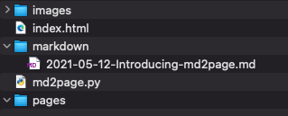
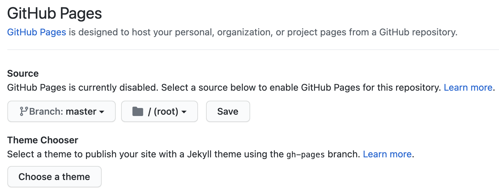
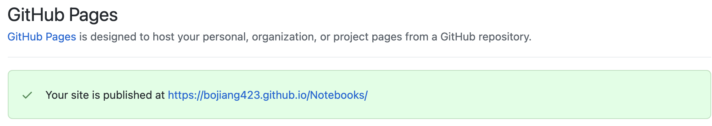

# Introducing md2page

## Why I created md2page

The purpose to create **md2page** was to find a simplest way to host a personal website. There are some existing site generators, like Jekyll and Material for MkDocs, but I think they're not simple enough.

I used to take note using MicroSoft OneNote, which was easy to use and powerful. But I found the problem when my subscription expired and wanted to transfer all my notes to another platform. It was not easy, as OneNote has its own format. So I decided to use Markdown to take note, which I can store the notes anywhere without platform limitation.

Futher more, I want to share my notes in my personal blog, as I don't need any fancy themes, just the simplest personal website, I chose Github page and tried **Jekyll** and **Material for MkDocs** to transform my markdown notes into html pages. Aftr playing with these two tools for a while, I decided to create my own tool to generate personal pages.

### Advantages of md2page

- You can just click the html file to verify the page, no need to host it like 127.0.0.1:8000
- No need to setup Github action

### Disadvantage of md2page

- This is just a initial version, the index page is super simple

### What to expect in the further versions

- More beautiful index page
- Categorize notes

## How to use md2page

1. Create a folder with any name you like, or just fork this git

2. Make sure the folder has following items

    

3. Place your markdown notes in "markdown" folder

4. Execute md2page.py in command line

    ``` Python
    python3 md2page.py
    ```

5. You html pages are ready, just click "index.html", your notes are linked

## How to host in Github page

1. Create a new repository

2. Copy or upload all the items in your folder

3. Go to "Settings -> Pages", choose **Branch** and **Source Folder**, click **Save**

    

4. Wait a few seconds, refresh the page, until you see below message

    

5. Your personal website is live!

## New pages

1. Create new markdown files in **markdown** folder

2. Execute md2page.py in command line

    ``` Python
    python3 md2page.py
    ```

3. Synchronise with github repository
